# 📊 PromptForge - Flow Diagrams (Boss Presentation)

---

## 1. User Journey Flow

```mermaid
flowchart TD
    A[🧑 User Visits PromptForge] --> B{Has Account?}
    B -->|No| C[Sign Up]
    C --> D[7-Day Trial Starts<br/>Basic Features]
    B -->|Yes| E[Login]
    E --> F{Subscription Status?}
    D --> F
    
    F -->|Active/Trial| G[Access Dashboard]
    F -->|Expired| H[Upgrade Prompt]
    H -->|Pay| I[Stripe Checkout]
    I --> G
    H -->|Skip| J[Limited Access<br/>Prompt Preview Only]
    
    G --> K[Select Category]
    K --> L[Fill Input Form]
    L --> M{Upload Image?}
    M -->|Yes| N[Image Analysis]
    M -->|No| O[Generate Prompt]
    N --> O
    O --> P[View Generated Prompt]
    P --> Q[Copy to Midjourney/SDXL]
    Q --> R[🎨 Create Stunning Images!]
```

---

## 2. System Architecture (High-Level)

---

## 3. Subscription & Payment Flow

---

## 4. Prompt Generation Flow (Core Logic)

---

## 5. Image Upload & Analysis Flow

---

## 6. Trial → Paid Conversion Flow

---

## 7. Category Selection Architecture

---

## Summary for Boss

| Aspect | Description |
|--------|-------------|
| **Product** | AI-powered prompt generator for marketing images |
| **Target** | SMEs, agencies, content creators |
| **Revenue** | Subscription SaaS (RM29-199/month) |
| **Tech** | Next.js, Supabase, Stripe, Claude AI |
| **Differentiator** | Image upload + product-specific prompts |
| **Scalability** | Serverless, multi-category expansion |

