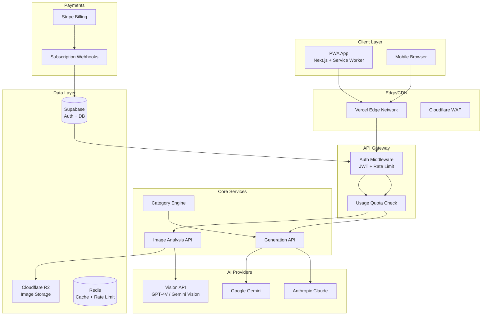
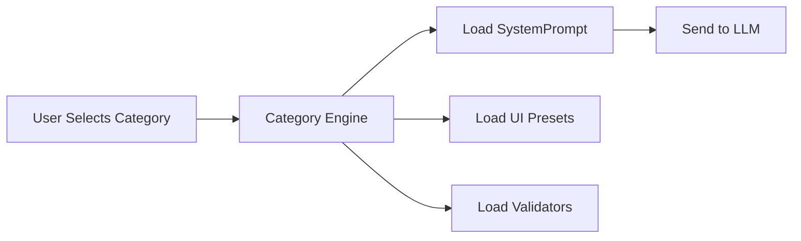
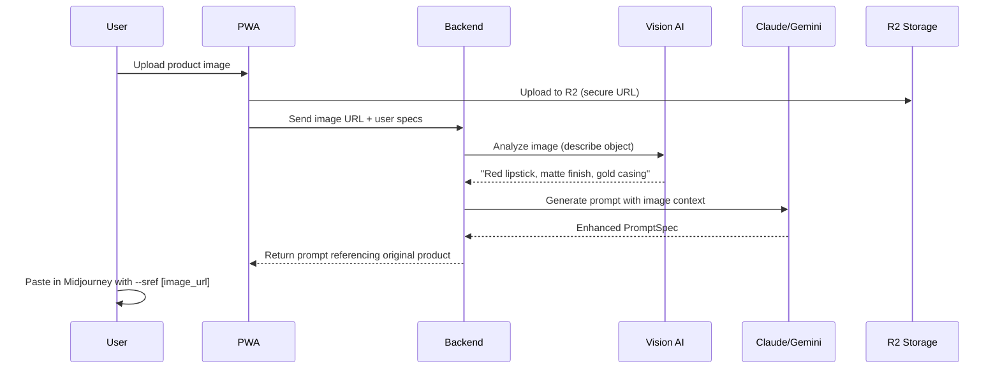
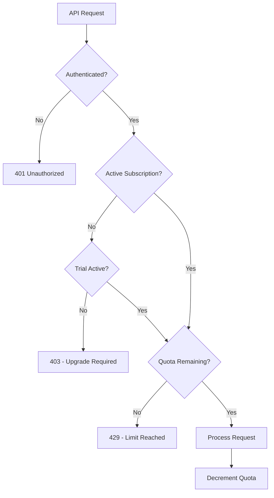

# 🚀 PromptForge SaaS Master Plan

## Executive Summary
Transform PromptForge from a prototype into a scalable, secure, multi-category PWA SaaS with subscription monetization, image-based prompt generation, and future-proof architecture.

---

## 1. High-Level System Architecture



---

## 2. Subscription Tiers & Pricing

| Feature | **Trial** | **Basic** | **Pro** | **Ultra** |
|---------|-----------|-----------|---------|----------|
| **Price** | RM0 (7 days) | RM29/mo | RM79/mo | RM199/mo |
| **Access Level** | = Basic | Full | Full | Full |
| **Prompts/Month** | 100 | 100 | 500 | Unlimited |
| **Categories** | 3 | 3 | All | All |
| **Image Upload** | 5 | 5/month | 50/month | Unlimited |
| **AI Quality** | Standard | Standard | Premium (Claude) | Premium + Priority |
| **History/Library** | 7 days only | 30 days | Forever | Forever |
| **API Access** | ❌ | ❌ | ❌ | ✅ |
| **Priority Queue** | ❌ | ❌ | ❌ | ✅ |
| **Support** | Community | Email | Priority | Dedicated |

> **Trial = Full Basic Access for 7 Days** (No credit card required)
> **Yearly Discount**: 20% off (e.g., Pro = RM759/year instead of RM948)

### Value Gates (Instead of Watermarks)
To encourage upgrades without annoying users:

1. **Quality Gap**: Free/expired users get template-based prompts. Paid users get full AI persona.
2. **Feature Lockout**: No image upload, limited categories for expired trials.
3. **Prompt Preview**: Expired users see 50% of generated prompt with "Upgrade to see full prompt..." blur.

---

## 3. Category System (Multi-Vertical)

### Phase 1 (Launch)
- 🍔 **F&B Marketing** (Current)
- 👗 **Fashion & Apparel**
- 🏠 **Real Estate / Interior**

### Phase 2 (3 months)
- 💄 **Beauty & Cosmetics**
- 🚗 **Automotive**
- ⌚ **Product Photography** (Generic)

### Phase 3 (6 months)
- 👤 **Portrait & Headshots**
- 🎮 **Gaming & Tech**
- ✈️ **Travel & Tourism**
- 🐾 **Pet Photography**

### Category Architecture


Each category has:
1. **SystemPrompt**: Unique persona (e.g., "Senior Fashion Stylist with 15 years...")
2. **UI Presets**: Mood options, props, backgrounds specific to that industry
3. **Validators**: Zod schemas tailored to expected outputs

---

## 4. Image Upload Feature (Product Reference)

### User Flow


### Technical Implementation
- **Vision API**: Use Gemini 1.5 Pro Vision or GPT-4V to extract:
  - Product description
  - Colors & textures
  - Brand elements
- **Prompt Injection**: Inject extracted details into SystemPrompt
- **Style Reference**: For Midjourney, append `--sref [user_image_url]` to maintain product identity

---

## 5. Security & Anti-Bypass

### Authentication
- **Supabase Auth** with email/password + OAuth (Google, Apple)
- **JWT tokens** with short expiry (15 min) + refresh tokens
- **Device fingerprinting** to detect account sharing

### Paywall Enforcement


### Anti-Abuse Measures
1. **Server-Side Generation**: All prompts generated on backend, never expose raw API keys
2. **Rate Limiting**: Per-user limits via Redis (e.g., 10 req/min for Basic)
3. **Quota Tracking**: Store usage in Supabase, check before every generation
4. **Webhook Verification**: Validate Stripe webhook signatures
5. **CORS Lockdown**: Only allow requests from your domain
6. **Obfuscation**: Minify frontend code, avoid exposing internal logic

---

## 6. PWA Implementation

### Features
- **Offline Mode**: Cache UI, show "offline" message for generation
- **Install Prompt**: Add to Home Screen on mobile
- **Push Notifications**: "Your prompt is ready!" / "Trial ending soon"
- **Background Sync**: Queue prompts when offline, generate when back online

### Technical Stack
- **next-pwa** package for service worker
- **Workbox** for caching strategies
- **Web Push API** for notifications

---

## 7. Database Schema (Supabase)

```sql
-- Users (extended from Supabase Auth)
CREATE TABLE profiles (
  id UUID REFERENCES auth.users PRIMARY KEY,
  display_name TEXT,
  subscription_tier TEXT DEFAULT 'free',
  subscription_status TEXT DEFAULT 'trialing',
  trial_ends_at TIMESTAMPTZ,
  stripe_customer_id TEXT,
  monthly_quota_used INT DEFAULT 0,
  quota_reset_at TIMESTAMPTZ,
  created_at TIMESTAMPTZ DEFAULT NOW()
);

-- Generated Prompts (History)
CREATE TABLE prompts (
  id UUID PRIMARY KEY DEFAULT gen_random_uuid(),
  user_id UUID REFERENCES profiles(id),
  category TEXT NOT NULL,
  input JSONB NOT NULL,
  output JSONB NOT NULL,
  image_url TEXT,
  created_at TIMESTAMPTZ DEFAULT NOW()
);

-- Usage Tracking
CREATE TABLE usage_logs (
  id UUID PRIMARY KEY DEFAULT gen_random_uuid(),
  user_id UUID REFERENCES profiles(id),
  action TEXT, -- 'generate', 'image_upload'
  credits_used INT DEFAULT 1,
  created_at TIMESTAMPTZ DEFAULT NOW()
);
```

---

## 8. Tech Stack Summary

| Layer | Technology |
|-------|------------|
| **Frontend** | Next.js 15 (App Router), TailwindCSS, Shadcn/ui, Zustand |
| **PWA** | next-pwa, Workbox |
| **Backend** | Next.js API Routes (Serverless) |
| **Auth** | Supabase Auth |
| **Database** | Supabase (PostgreSQL) |
| **Payments** | Stripe (Subscriptions, Checkout, Webhooks) |
| **AI** | Anthropic Claude, Google Gemini, Vision APIs |
| **Storage** | Cloudflare R2 (images) |
| **Cache** | Upstash Redis |
| **Hosting** | Vercel (Edge) |
| **CDN/Security** | Cloudflare |

---

## 9. Roadmap (Phases)

### Phase 0: Foundation (Current → 2 weeks)
- [ ] Supabase Auth integration
- [ ] Stripe subscription setup
- [ ] Basic quota system
- [ ] PWA manifest + service worker

### Phase 1: MVP Launch (Week 3-4)
- [ ] 3 categories live (F&B, Fashion, Real Estate)
- [ ] Image upload (basic)
- [ ] Trial system (7 days)
- [ ] Payment flow complete

### Phase 2: Growth (Month 2-3)
- [ ] 6+ categories
- [ ] Vision AI integration (product analysis)
- [ ] Prompt history/library
- [ ] Referral system

### Phase 3: Scale (Month 4-6)
- [ ] API access for Ultra users
- [ ] Team/Agency accounts
- [ ] White-label option
- [ ] Mobile app (React Native wrapper)

---

## 10. Key Features That Drive Subscriptions

1. **"Magic" Quality Gap**: Expired users get basic templates. Paid tiers use advanced AI persona
2. **Image Reference**: Unique selling point - upload YOUR product, get prompts for IT
3. **Category Expansion**: Users subscribe to unlock more industries
4. **History Lock**: Expired users lose history, forcing upgrade to save
5. **Prompt Preview**: Show partial output to expired users, teasing full value
6. **Priority Queue**: During peak times, paid users get faster generation
7. **Export Options**: Pro users can export to CSV, share prompt libraries

---


---

## 11. Admin Dashboard (Super Admin)

### A. Analytics & Health
- **Revenue (MRR)**: Stripe integration for real-time sales view
- **API Cost Monitor**: Track Anthropic/OpenAI spend vs Revenue
- **User Growth**: Signups vs Churn rate

### B. User Management
- **Impersonation**: "Log in as user" to debug customer issues
- **Manual Grant**: Give free Pro Access to influencers/team
- **Ban/Suspend**: Stop abusers or bots

### C. System Config
- **Model Switcher**: Emergency toggle (e.g., Switch from Claude to Gemini if API down)
- **Maintenance Mode**: Close signups temporarily
- **Announcement Banner**: Push global alerts to all active users

---

## Next Steps
1. Review and approve this architecture
2. Set up Supabase project
3. Set up Stripe account with subscription products
4. Begin Phase 0 implementation

